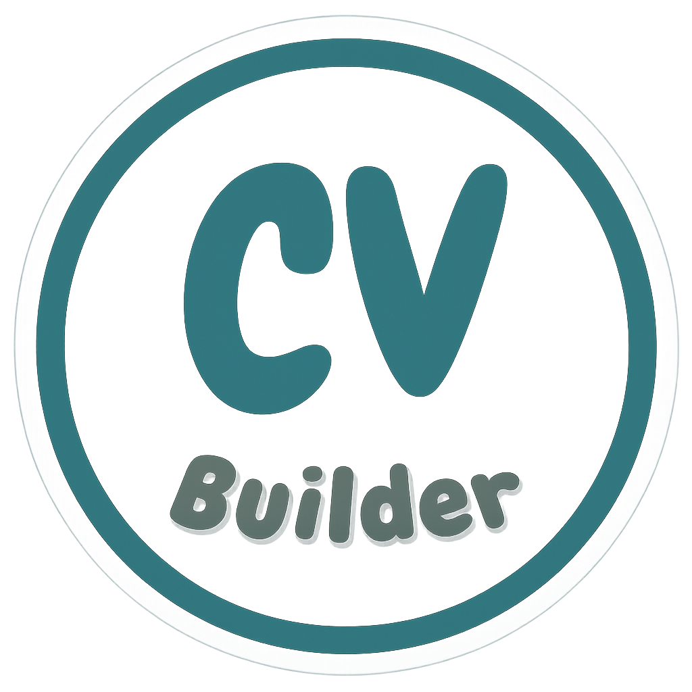

# CV Builder

<div align="center">



#### A sleek, modern React application for creating professional resumes with live preview and instant PDF download

[](https://reactjs.org/)
[](https://vitejs.dev/)
[](https://www.w3.org/WAI/fundamentals/accessibility-intro/)
[](https://web.dev/learn/performance/)
[](https://developers.google.com/search/docs/fundamentals/seo-starter-guide)
[](https://www.canva.com/)

</div>

## Overview

CV Builder is a dynamic web application that streamlines the resume creation process. Built with modern React practices and a component-based architecture, it offers an intuitive interface for creating, customizing, and downloading professional resumes. This project demonstrates strong front-end development skills across React state management, component architecture, responsive design, and UX considerations.

<div align="center">

[Features](#features) •
[Technologies](#technologies) •
[Live Demo](#live-demo) •
[Installation](#installation) •
[Architecture](#architecture) •
[What I Learned](#what-i-learned)

</div>

## Features

### Dynamic & Interactive

- **Complete Resume Builder** with customizable sections:

  - Profile with photo upload
  - Address with dynamic country-state-city selection
  - Social & website links
  - Work experience with current position toggle
  - Education with current studies option
  - Technical skills with proficiency ratings
  - Languages with fluency indicators
  - Projects with technologies and links
  - Certifications with credential verification
  - Awards & achievements
  - Interests & hobbies

- **User-Focused Experience**:
  - Multi-step form with intuitive navigation
  - Real-time resume preview
  - Option to skip non-essential sections
  - Engaging welcome page with clear CTAs

### Customization & Output

- **Template Options**:

  - Multiple professionally designed templates
  - Dynamic font style selection
  - Visual indicators for skills and languages

- **Export Ready**:
  - One-click PDF download
  - Print-optimized layout

### Technical Excellence

- **Performance & Accessibility**:
  - Optimized for speed and performance
  - 100% accessibility score
  - Fully responsive across all devices
  - SEO-optimized with meta tags

## Technologies

### Core Technologies

- **React** - Component-based UI with extensive hooks usage
- **Vite** - Lightning-fast build tool and development server
- **CSS Modules** - Scoped styling with no style conflicts

### Key Libraries

- **html2canvas & jsPDF** - PDF generation functionality
- **country-state-city** - Dynamic location dropdowns
- **react-icons** - Professional UI iconography

### Development Approach

- **Component Architecture** - Modular, reusable components
- **Custom Hooks** - For shared functionality
- **Responsive Design** - Mobile-first approach
- **Semantic HTML** - Accessibility and SEO optimization

### Logo Design

The app logo was designed using **Canva**, leveraging its user-friendly interface and customization options to create a professional and visually appealing graphic that aligns with the app's branding.

## Live Demo

[View Live Demo](https://your-cv-builder-demo-url.com)

## Installation

```bash
# Clone the repository
git clone https://github.com/yourusername/cv-builder.git

# Navigate to project directory
cd cv-builder

# Install dependencies
npm install

# Start development server
npm run dev

# Build for production
npm run build
```

## Architecture

The application follows a structured component-based architecture with state management through React hooks.

### Component Structure

```
src/
├── App.jsx                   # Main application component with state management
├── components/               # Reusable components
│   ├── UserInput/            # Form components
│   │   ├── Address.jsx       # Dynamic country-state-city selection
│   │   ├── BasicInformation.jsx # Profile details with photo upload
│   │   ├── CareerSummary.jsx # Professional summary
│   │   ├── Education.jsx     # Educational background
│   │   ├── Skills.jsx        # Technical skills with proficiency
│   │   ├── UserInput.jsx     # Form navigation container
│   │   └── ... (other input sections)
│   └── Display/              # Output components
│       ├── Display.jsx       # Template container with PDF export
│       ├── TemplateOne.jsx   # First resume template
│       └── TemplateTwo.jsx   # Second resume template
└── styles/                   # CSS modules and shared styles
```

### State Management

The application employs a sophisticated state management approach:

- **Centralized State** - Main state objects managed in App.jsx
- **Prop Drilling** - Passing state and handlers to child components
- **Dynamic Object Management** - Complex state structures for sections like Work Experience
- **Conditional Rendering** - Toggle visibility based on user choices

### Key Implementation Details

#### Dynamic Form Sections

```jsx
// Example of dynamic field management in WorkExperience.jsx
const addWorkExperience = () => {
  setWorkExperiencesField((wef) => [
    ...wef,
    {
      id: Date.now(),
      experienceFieldNo:
        wef.length > 0 ? wef[wef.length - 1].experienceFieldNo + 1 : 0,
      jobTitle: '',
      companyName: '',
      location: '',
      startDate: '',
      endDate: '',
      currentlyWork: false,
      achievements: '',
    },
  ]);
};
```

#### Two-Way Template Binding

```jsx
// Template switching logic in Display.jsx
const [currentTemplate, setCurrentTemplate] = useState('TemplateOne');

const templates = {
    TemplateOne: <TemplateOne {...commonProps} />,
    TemplateTwo: <TemplateTwo {...commonProps} />,
};

// Render selected template
<div className={Styles.template_parent} ref={pdfRef}>
    {templates[currentTemplate]}
</div>
```


#### PDF Generation

```jsx
// PDF export functionality
const handleDownloadPdf = async () => {
  const element = pdfRef.current;
  if (!element) return;

  const canvas = await html2canvas(element, {
    scale: 2,
    useCORS: true,
    scrollX: 0,
    scrollY: 0,
  });

  const imgData = canvas.toDataURL('image/png');
  const pdf = new jsPDF({
    orientation: 'portrait',
    unit: 'mm',
    format: 'a4',
  });

  const pageWidth = pdf.internal.pageSize.getWidth();
  const pageHeight = pdf.internal.pageSize.getHeight();

  const imgProps = pdf.getImageProperties(imgData);
  const imgWidth = imgProps.width;
  const imgHeight = imgProps.height;

  const ratio = Math.min(pageWidth / imgWidth, pageHeight / imgHeight);

  const scaledWidth = imgWidth * ratio;
  const scaledHeight = imgHeight * ratio;

  pdf.addImage(
    imgData,
    'PNG',
    (pageWidth - scaledWidth) / 2,
    0,
    scaledWidth,
    scaledHeight
  );

  pdf.save('Your-Resume-CV-Builder.pdf');
};
````

## What I Learned

This project provided comprehensive experience in modern React development:

### React & State Management

- Advanced useState implementation for complex object structures
- Strategic component tree design with props distribution
- Dynamic component rendering based on user selections
- Conditional rendering patterns for improved UX

### User Experience & Design

- Creating intuitive multi-step form interactions
- Implementing an effective welcome/onboarding experience
- Balancing functionality with visual appeal
- Building a responsive layout that works across devices

### Dynamic Form Handling

- Adding/removing form fields dynamically
- Managing complex nested state objects
- Implementing form validation and constraints
- Providing real-time preview of user inputs

### Technical Skills

- PDF generation from HTML/CSS content
- Dynamic dropdown population with third-party libraries
- Implementing copy-to-clipboard functionality
- CSS module scoping for maintainable styles

### Best Practices

- Building accessible UI components
- Implementing SEO best practices
- Performance optimization techniques
- Clean code and component reusability

### Design Skills

While creating the app logo, I learned to use **Canva** for designing sleek and professional graphics. This included:

- Exploring Canva's intuitive drag-and-drop interface.
- Utilizing pre-designed templates for quick prototyping.
- Customizing elements like icons, fonts, and colors to align with the app's branding.
- Exporting high-quality images optimized for web usage.

This experience enhanced my understanding of design principles and how to create visually appealing assets for web applications.

## License

This project is licensed under the MIT License - see the [LICENSE](LICENSE) file for details.

## Author

**Md Umar Siddique** - [GitHub Profile](https://github.com/umarSiddique010)

---

<div align="center">

### Thanks for exploring CV Builder!

If you found this project interesting, please consider giving it a star! ⭐

[⬆ Back to Top](#cv-builder)

</div>
