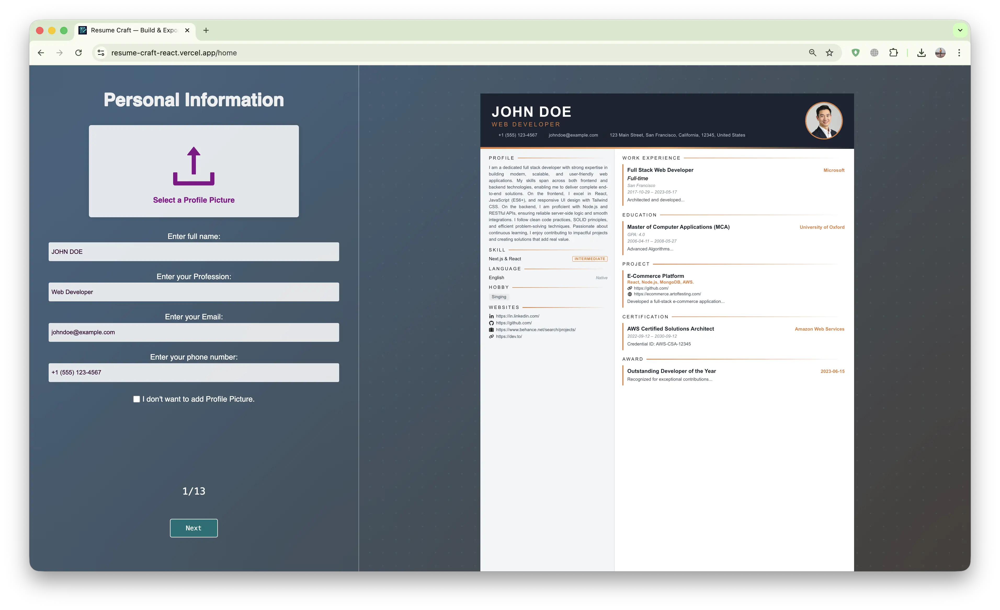

#  Resume Craft

<div align="center">

### Craft Your Perfect Resume.

<p align="center">
  <strong>A production-grade React 19 resume builder with multiple templates,
  ATS-friendly output, PDF export, and a fully tested codebase.</strong>
</p>

<p align="center">
  <a href="https://resume-craft-react.vercel.app/"><strong>View Live Production Deployment</strong></a>
  &nbsp;&nbsp;&bull;&nbsp;&nbsp;
  <a href="#local-development"><strong>Local Setup</strong></a>
  &nbsp;&nbsp;&bull;&nbsp;&nbsp;
  <a href="https://github.com/umarSiddique010/resume-craft-react"><strong>Repository</strong></a>
  &nbsp;&nbsp;&bull;&nbsp;&nbsp;
  <a href="https://github.com/umarSiddique010/resume-craft-react/issues"><strong>Report an Issue</strong></a>
</p>

[](https://react.dev/)
[](https://vitejs.dev/)
[](https://developer.mozilla.org/en-US/docs/Web/JavaScript)
[](https://reactrouter.com/)
[](https://react-pdf.org/)
[](https://vitest.dev/)
[](https://typicode.github.io/husky/)
[](https://github.com/lint-staged/lint-staged)
[](https://vercel.com/)

</div>

## Overview

**Resume Craft** is a fully client-side resume builder built with **React 19** and **Vite**. Users instantly generate a professional PDF resume — **no backend, no login, and no data storage**. Since **privacy matters**, all data stays in the browser and never leaves the user's device.

The project is engineered with a focus on code quality: a strict **Context + Reducer** state architecture, strong **Vitest** coverage across components, templates, and reducer logic, and an automated **Husky + Lint-Staged** pre-commit pipeline.

## Application Preview



## Features & Architecture

### 1. Four Professional Resume Templates

- **Bold Accent** — Modern two-column layout with a dark navy header, gold accent elements, and skill badges — set as the default template
- **Standard** — Clean two-column layout with an olive sidebar and profile picture support
- **Classic** — Traditional single-column design with a centered header
- **ATS-Friendly** — Text-only, parser-safe layout built with `@react-pdf/renderer` to pass automated applicant tracking systems

### 2. Client-Side PDF Generation

PDF export runs entirely in the browser — no server round-trips, no file uploads.

- **`@react-pdf/renderer`** handles the ATS template as a true PDF document with preserved text layers
- **`html2pdf.js` + `html2canvas`** captures the live DOM preview for high-fidelity layout export on Bold Accent, Standard, and Classic templates
- **6 Custom Font Choices** — Roboto, Google Sans Code, Poppins, Playwrite NZ, Delius Swash Caps, Rubik Distressed

### 3. Global State: Context + Reducer

All resume data lives in a single state tree managed by `useReducer` inside `InputFieldContext`. No Redux, no Zustand — just clean React primitives.

- **Typed Action Constants** — Every section (Work, Education, Skills, Projects, etc.) has its own scoped `ADD / UPDATE / REMOVE / REMOVE_ALL` action types defined in `resumeTypes.js`
- **Pure Reducer** — `resumeReducer.js` is a single pure function with zero side effects, making it fully deterministic and easy to test
- **Live Preview** — `DisplayTemplate` consumes context directly, so the resume preview re-renders in real time as the user types

```
User types in form
      ↓
dispatchField({ type: UPDATE_WORK_EXPERIENCE_FIELD, payload })
      ↓
resumeReducer → new state
      ↓
InputFieldContext re-renders consumers
      ↓
<DisplayTemplate /> updates instantly
      ↓
User clicks Download → PDF generated client-side
```

### 4. Testing & Quality Assurance

This project treats testing as a first-class citizen, not an afterthought.

- **Unit Testing** — All components (WelcomePage, HomePage, all UserInput sections, all four templates) and reducer logic are tested using **Vitest** and **React Testing Library**
- **Reducer Tests** — Comprehensive test cases validate the `resumeReducer` across core action paths including add, update, remove, and key edge cases.
- **Mocking Strategy** — External dependencies like `@react-pdf/renderer`, `react-router-dom`, and `html2pdf.js` are mocked to ensure isolated, deterministic tests

### 5. CI Pipeline

Every push and PR to `main` must pass all three jobs in `.github/workflows/ci.yml` before merging:

- **Quality** — Runs `npm run check` (ESLint + Prettier) on every push and PR
- **Test** — Runs `npm run coverage` (Vitest); build job won't start until this passes
- **Build** — Runs `npm run build` only after tests pass (`needs: test`), verifying the production build is never broken
- **Git Hooks (Husky + Lint-Staged)** — ESLint and Prettier also enforced locally on pre-commit, so issues are caught before they ever reach CI

### 6. Performance Optimizations

- **Route-level Code Splitting** — All routes are lazy-loaded via `React.lazy` + `Suspense`, keeping the initial bundle minimal
- **Manual Chunk Splitting** — `@react-pdf/renderer`, `react-icons`, and vendor libraries are split into separate chunks via Vite's `manualChunks`
- **Font Preloading** — Critical fonts preloaded in `index.html` via `<link rel="preload">`
- **Local Fonts Only** — All fonts are self-hosted `woff2` files; no external CDN dependency

## Tech Stack

| Category             | Technology                    | Usage                                         |
| :------------------- | :---------------------------- | :-------------------------------------------- |
| **UI Library**       | **React 19**                  | Component architecture, hooks, context        |
| **Build Tool**       | **Vite**                      | Dev server and production bundler             |
| **State Management** | **Context + useReducer**      | Global resume state with typed actions        |
| **PDF Generation**   | **@react-pdf/renderer**       | ATS-friendly true PDF rendering               |
| **PDF Export**       | **html2pdf.js / html2canvas** | High-fidelity DOM-to-PDF download             |
| **Routing**          | **React Router v7**           | Client-side page navigation                   |
| **Location Data**    | **country-state-city**        | Address field dropdowns                       |
| **Testing**          | **Vitest + RTL**              | Unit tests for all components and reducers    |
| **Code Quality**     | **ESLint + Prettier**         | Enforced style and lint rules                 |
| **Git Hooks**        | **Husky + Lint-Staged**       | Pre-commit validation pipeline                |
| **CI**               | **GitHub Actions**            | Quality → Test → Build pipeline on every push |
| **Deployment**       | **Vercel**                    | Edge deployment, auto-deploys on push to main |

## Local Development

### Prerequisites

- Node.js 18+ (LTS recommended)
- npm

### 1. Clone the Repository

```bash
git clone https://github.com/umarSiddique010/resume-craft-react.git

cd resume-craft-react
```

### 2. Install Dependencies

```bash
npm install
```

### 3. Run Development Server

```bash
npm run dev
```

Open [http://localhost:5173](http://localhost:5173) to view the application.

### 4. Running Tests

```bash
# Run full test suite
npm test

# Run with interactive UI
npm run test:ui

# Generate coverage report
npm run coverage
```

### 5. Lint & Format

```bash
# Check lint + format together
npm run check

# Auto-fix lint issues
npm run lint:fix

# Auto-format all files
npm run format
```

---

## Project Structure

```text
src
├── assets/                     # Images, icons, fonts
├── components/
│   ├── DisplayTemplate/       # Resume templates (Bold Accent, Standard, Classic, ATS)
│   ├── HomePage/              # Main split layout
│   ├── UserInput/             # Form sections (Personal, Skills, Projects, etc.)
│   └── WelcomePage/           # Landing page
├── context/
│   └── UserInputContext/
│       ├── InputFieldContext.jsx
│       └── reducer/
│           ├── resumeReducer.js
│           ├── resumeTypes.js
│           ├── resumeInitialState.js
│           └── reducerInputUtils.js
├── App.jsx                     # Application routing & Lazy load fallback UI
├── main.jsx                    # React entry point
└── setupTests.js               # Vitest
```

---

## Contributing

Contributions are welcome. Here's how to get started:

**1. Fork & Clone**

```bash
git clone https://github.com/umarSiddique010/resume-craft-react.git

cd resume-craft-react

npm install
```

**2. Create a Branch**

```bash
git checkout -b feat/your-feature-name
```

**3. Make Your Changes**

- Follow existing code style (ESLint + Prettier enforce this automatically on commit)
- Add or update tests for any changed logic
- Keep all state changes inside the reducer — no local state for resume data

**4. Open a Pull Request**

- Target the `main` branch
- Write a clear title and description
- Reference related issues with `Closes #issue-number`

**Guidelines:** One feature or fix per PR. Don't remove existing tests. If adding a new template, follow the same props structure as existing ones.

---

<div align="center">

### Developer & Maintainer

**Md Umar Siddique**

<p align="center">
  <a href="https://www.umarsiddique.dev/">
    
  </a>
  <a href="https://www.linkedin.com/in/md-umar-siddique-1519b12a4/">
    
  </a>
  <a href="https://github.com/umarSiddique010">
    
  </a>
  <a href="https://www.npmjs.com/~umarsiddique010">
    
  </a>
  <a href="https://dev.to/umarsiddique010">
    
  </a>
  <a href="mailto:us70763@gmail.com">
    
  </a>
</p>

&copy; 2024 - Present. Released under the MIT License.

</div>
